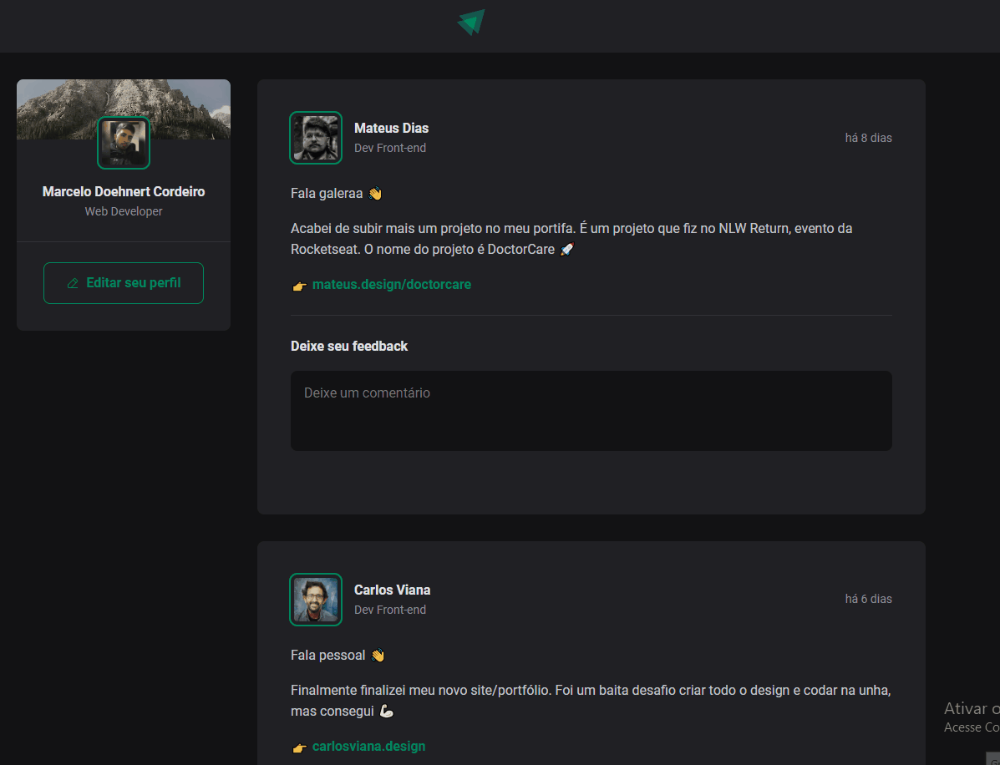

<h1 align="center">Ignite Feed</h1>

  <a href="#-tecnologias">Tecnologias</a>&nbsp;&nbsp;&nbsp;|&nbsp;&nbsp;&nbsp;
  <a href="#-projeto">Projeto</a>&nbsp;&nbsp;&nbsp;|&nbsp;&nbsp;&nbsp;
  <a href="#-features">Features</a>&nbsp;&nbsp;&nbsp;|&nbsp;&nbsp;&nbsp;
  <a href="#-contato">Contato</a>

 

  

## 🚀 Tecnologias

Esse projeto foi desenvolvido com as seguintes tecnologias:

- [React](https://reactjs.org)
- [Typescript](https://www.typescriptlang.org)
- [Vite](https://vitejs.dev)

## 💻 Projeto

Essa aplicação é um feed de uma rede social feito com ReactJS.

## ✨ Features

- Poder comentar nas publicação criadas;
- Curtir os comentários;
- Excluir comentários;

## 📲 Contato

Entre em contato comigo por e-mail ou pelo meu LinkedIn:

<a href="mailto:marcelodoehnert@hotmail.com">E-mail</a>&nbsp;&nbsp;&nbsp;|&nbsp;&nbsp;&nbsp;<a href="https://www.linkedin.com/in/marcelo-doehnert-cordeiro/">LinkedIn</a>